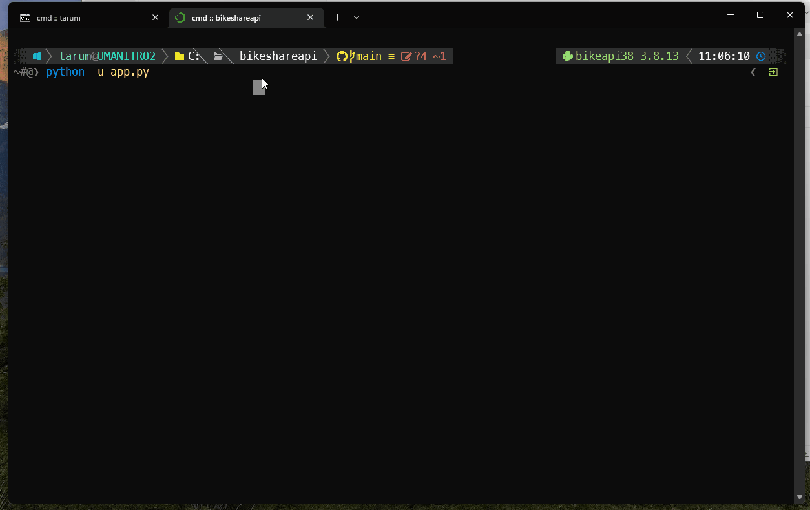
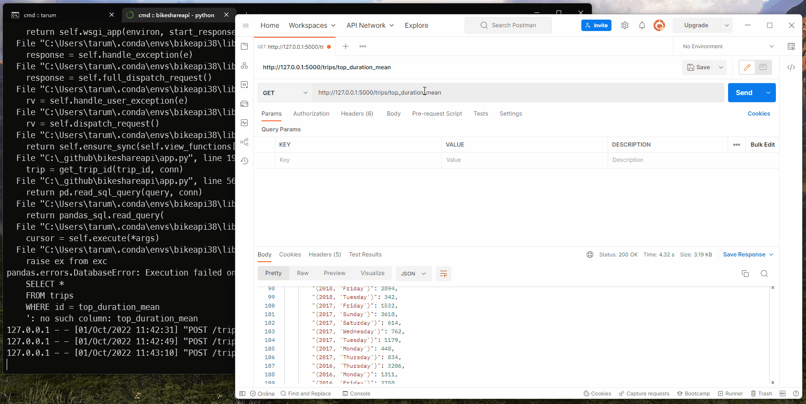
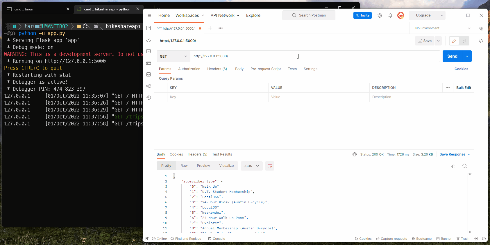
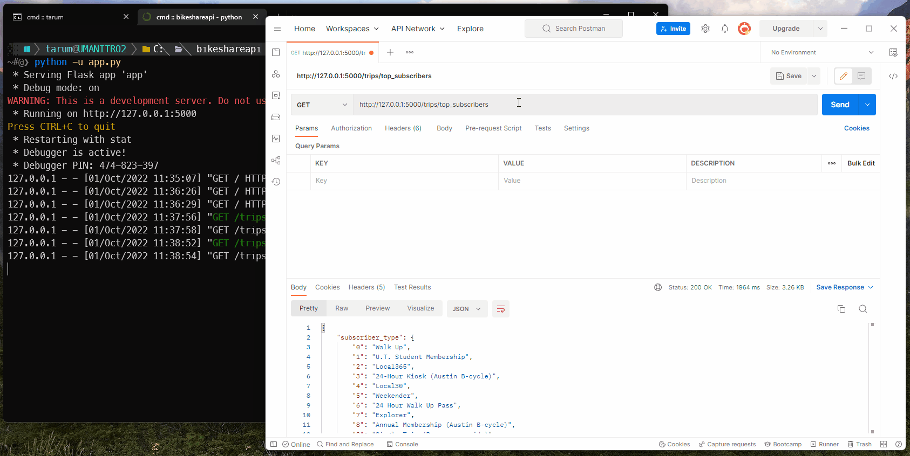
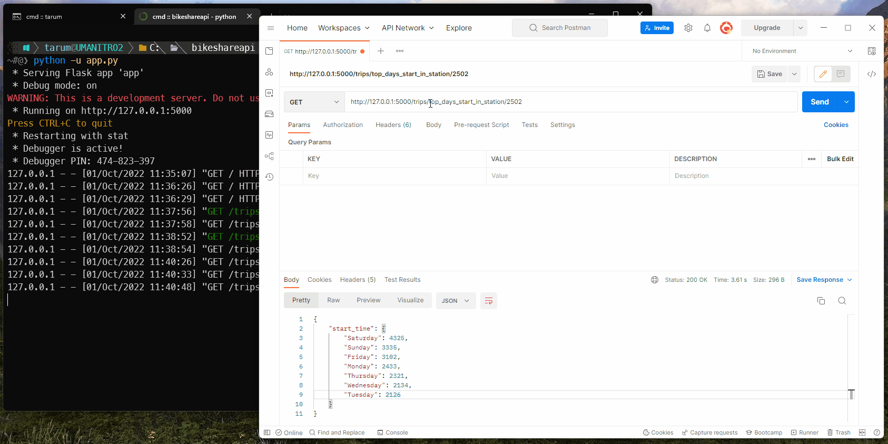

# Bike Sharing API

> For original README (Introduction of capstone project) visit [OLD README](./OLD_README.md)

## SETUP

Pengaturan environment dapat menggunakan `environment.yml` (mengutamakan channel `conda-forge`). Untuk pip dapat menggunakan `requirements.txt`. Environment ini digunakan saat menggunakan VSCODE (ipykernel) dan test API (requests). 

- Install langsung menggunakan conda

```bash
conda env create -f "https://raw.githubusercontent.com/taruma/bikeshareapi/main/environment.yml"
```

## TEST FOR RUBRIC

### 1 [1] Created Flask App

- Menjalankan aplikasi _flask_ `app.py`. 



### 2 [2] Created functionality to read to get specific data from the database

- Mengambil data berdasarkan `id` dari database `trips`.



### 3 [4] Created functionality to input new data into each table for the databases

- Memasukkan data `austin_bikeshare_trips_2021.csv` ke database `trips`.


### 4 [3] Created static endpoints which return analytical result (must be different from point 2,3)

- Memperoleh daftar tipe subscriber yang diurutkan dari terbanyak hingga tersedikit. Return: JSON (dari `DataFrame`).

```python
def top_subscribers(conn):
    query = """
    SELECT 
        trips.subscriber_type,
        COUNT(subscriber_type) AS total_subscriber
    FROM trips
    GROUP BY trips.subscriber_type
    ORDER BY total_subscriber DESC
    """
    return pd.read_sql_query(query, conn)

# ...

### Static Endpoint
@app.route('/trips/top_subscribers/')
def route_trips_top_subscriber():
    conn = make_connection()
    top_list = top_subscribers(conn)
    return top_list.to_json()
```



### 5 [3] Created dynamic endpoints which return analytical result (must be different from point 2,3,4)

- Menampilkan jumlah penggunaan _bike_ pada hari Senin-Minggu pada stasiun tertentu (`start_station_id`), diurutkan dari yang tertinggi hingga terendah. RETURN: JSON (from `DataFrame`) atau Text (jika station tidak ditemukan). 

```python
def top_days_start_in_station(start_station_id, conn):
    try:    
        return (
            pd.read_sql_query(
                f"""
                SELECT bikeid, start_time, start_station_id
                FROM trips
                WHERE trips.start_station_id = {start_station_id}
                """,
                conn,
                parse_dates='start_time'
            ).assign(
                start_day_of_week=lambda x: x.start_time.dt.day_name()
            ).pivot_table(
                index='start_day_of_week',
                values='start_time',
                aggfunc='count'
            ).sort_values('start_time', ascending=False)
        )
    except:
        return f"STATION ID {start_station_id} NOT FOUND!"

### ...

### dynamic endpoints
@app.route('/trips/top_days_start_in_station/<station_id>')
def route_top_days_start_in_station(station_id):
    conn = make_connection()
    top_days = top_days_start_in_station(station_id, conn)
    return top_days.to_json() if isinstance(top_days, pd.DataFrame) else top_days
```



### 6 [3] Created POST endpoint which receive input data, then utilize it to get analytical result (must be different from point 2,3,4,5)

- Mengirimkan informasi `subscriber_type` dan bulan (dalam bentuk angka `00`) dan memperoleh informasi daftar informasi jumlah penggunaan _bike_, rata-rata + median + maksimum durasi penggunaan _bike_ yang diagregasi setiap tahun dan hari Senin-Minggu. RETURN: JSON (dari `DataFrame`).

```python
def top_duration_mean(subscriber_type, month_number, conn):
    return (
        pd.read_sql_query(
            f"""
            SELECT *
            FROM trips
            WHERE 
                trips.subscriber_type LIKE '{subscriber_type}'
                AND trips.start_time LIKE '%-{month_number}-%'
            """,
            conn,
            parse_dates='start_time'
        )
        .assign(
            start_year=lambda df: df.start_time.dt.year,
            start_dow=lambda df: df.start_time.dt.day_name()
        )
        .groupby(['start_year', 'start_dow']).agg({
            'bikeid': 'count',
            'duration_minutes': ['median', 'mean', 'max'],
        })
        .droplevel(0, axis='columns')
        .sort_values(['start_year', 'mean'], ascending=[False, False], axis='index')
        .rename({'median': 'duration_median', 'mean':'duration_mean', 'max':'duration_max'}, axis='columns')
    )

# ...

### post endpoint
@app.route('/trips/top_duration_mean', methods=['POST'])
def route_top_duration_mean():
    data_input = request.get_json(force=True)
    conn = make_connection()
    return top_duration_mean(conn=conn, **data_input).to_json()
```



---

#### Kekurangan / TO-DO LIST

- penggunaan nama fungsi yang masih dibilang kurang singkat dan jelas. Seperti fungsi `top_subscriber()` yang sebaiknya menjadi `top_subscribers_type()`.
- endpoint harusnya menggunakan dash `-` dibandingkan `_`. Info: [Hyphen, underscore, or camelCase as word delimiter in URIs?](https://stackoverflow.com/questions/10302179/hyphen-underscore-or-camelcase-as-word-delimiter-in-uris)
- pada endpoint `/trips/top_duration_mean`, seharusnya jangan menggunakan _unpacking_ dictionary pada fungsinya, untuk menghindari _error_ ketika menerima _keyword_ yang tidak ada.
- memisahkan _logic function_ ke file yang berbeda. 
- validasi data sebelum diproses. (data yang hilang, dlsbnya).
- untuk operasi `count` seharusnya mengacu pada `bikeid`. 
- single output endpoint, jadi endpointnya mengeluarkan nilai, bukan `dataframe.to_json()`.
- refactor kode. 🤣
